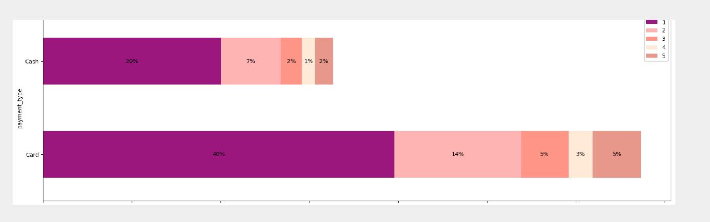
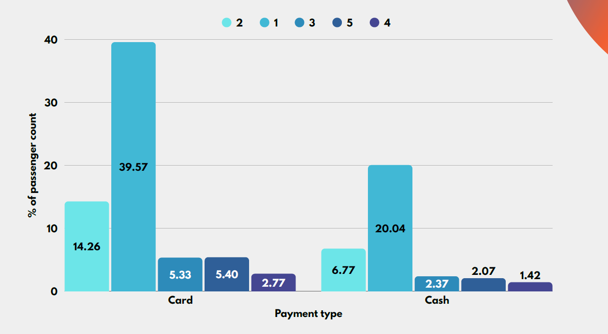
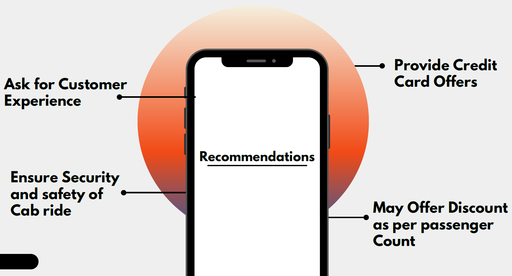

# maximizing-revenue-for-NYC-cab-drivers-using-python

## What be the problem?

This project's goal is to run an A/B test to examine the relationship
between the total fare and method of payment.
In this, we would use Python programming language, hypothesis
testing, and Descriptive Statistics to extract useful information that
can help cab drivers generate more cash.
In this particular case, we want to find out if there is big difference in
the for those who pay with credit cards versus those who pay with
cash.

## What about the research problem?

In the fast-paced booking sector, making the most of revenue is essential
for long-term success and driver happiness. Our goal is to use data-driven
insights to maximize revenue streams for taxi drivers in order to meet this
need. Our research aims to determine whether payment methods have an
impact on fare pricing by focusing on the relationship between payment
type and fare amount.

## After the analysis, we conclude the following information 
These image you can also get from the notebooks code i added these screenshorts images.

* First Image

* Second Image

* Final Conclusion Image

- Thanksyou, Please let me know if you found any error.
